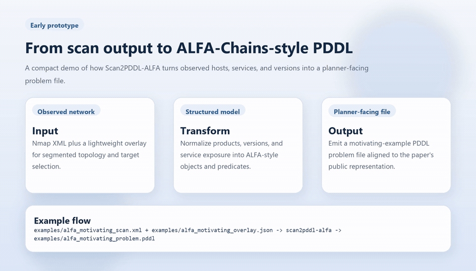
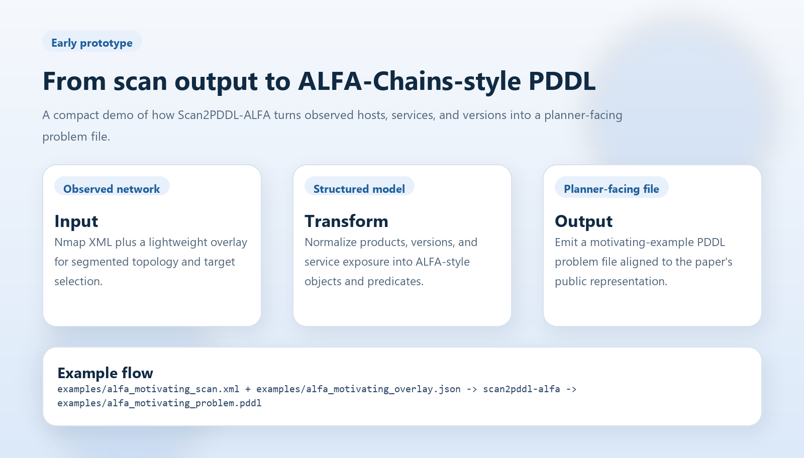
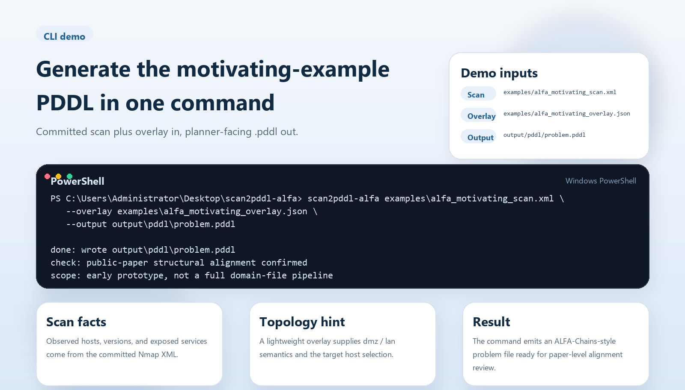
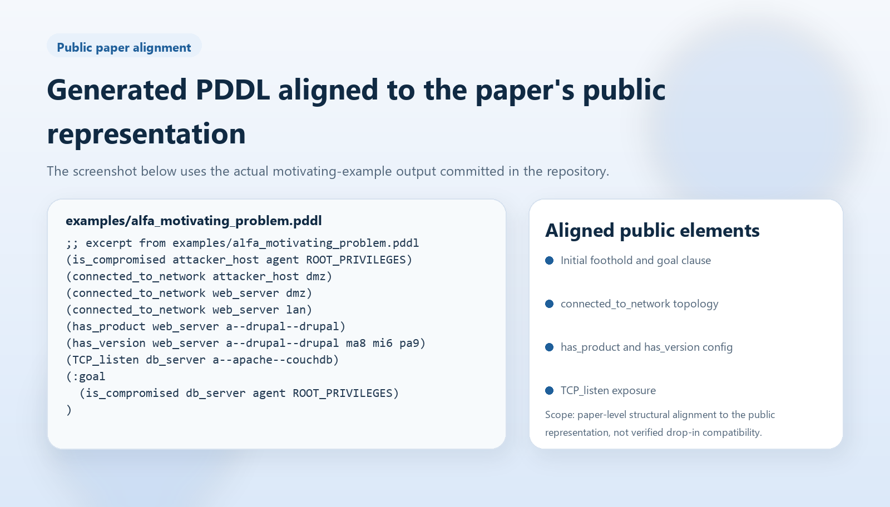

# Demo Walkthrough

This page collects the public demo assets for `Scan2PDDL-ALFA` in one place.
The goal is to make the prototype easy to inspect without requiring a local
setup.

## Animated Overview



- [Download the short demo video (MP4)](media/scan2pddl_alfa_demo.mp4)
- [View the generated motivating-example problem file](../examples/alfa_motivating_problem.pddl)

## Slide 1: Scope



This slide positions the repository as an early prototype that transforms
`scan output -> ALFA-Chains-style problem file`. It is intentionally limited to
problem-file generation.

## Slide 2: CLI Demo



This slide shows the concrete workflow:

- the committed `Nmap XML` input
- the lightweight overlay used for topology semantics
- the single command that emits a planner-facing `.pddl` file

## Slide 3: Public Paper Alignment



This slide highlights the public PDDL elements reproduced by the motivating
example, including:

- `is_compromised`
- `connected_to_network`
- `has_product`
- `has_version`
- `TCP_listen`
- the final goal clause

## Regenerating The Demo Assets

The demo images and video are generated from:

```bash
python scripts/generate_demo_media.py
```

The generated local artifacts are written to `output/media/`, and the committed
public copies live in `docs/media/`.
